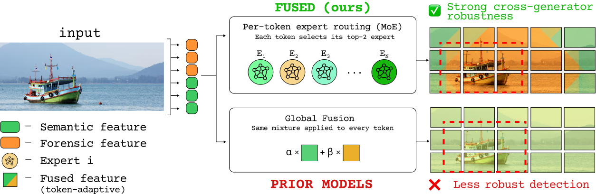
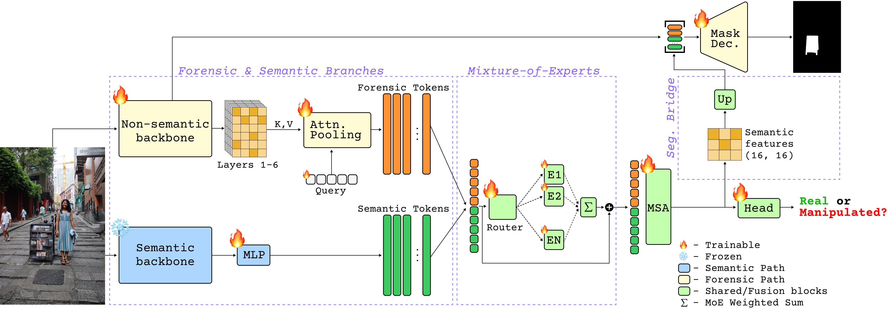

<div align="center">

# FUSED: Forensic–Semantic Mixture-of-Experts for AI Inpainting Detection and Localization

**[Anton Nuzhdin](https://scholar.google.com/citations?user=MfkaQdMAAAAJ&hl=en) ·
[Marcel Worring](https://staff.fnwi.uva.nl/m.worring/) ·
[Ivona Najdenkoska](https://ivonajdenkoska.github.io/)**

Informatics Institute, University of Amsterdam

[](https://arxiv.org/abs/2608.28302)
[](https://huggingface.co/aonuzhdin/FUSED)
[](https://www.python.org/)
[](https://pytorch.org/)

</div>

Official implementation of FUSED, a single model that jointly **detects** and **localizes**
AI inpainting. FUSED couples a trainable forensic branch with a frozen semantic branch through
a sparsely-gated Mixture-of-Experts that routes **every token individually**, and a segmentation
bridge that decodes the tampering mask from both streams.

## Abstract

Diffusion-based inpainting models modify only a localized part of an image, while many AI-image
detectors rely on global artifacts and do not localize. These artifacts vary across generators,
limiting detector transfer under distribution shifts. Recent work shows that restoring the
authentic pixels outside the inpainted region removes these cues and can degrade pretrained
detectors. To address this, we present FUSED, a unified framework for the joint detection and
localization of AI-generated inpainting. FUSED combines low-level forensic cues with high-level
semantic features using a sparsely-gated Mixture-of-Experts architecture, enabling the model to
adaptively prioritize the most relevant signal for each token. For each input, FUSED predicts both
an image-level manipulation score and a pixel-level mask of the inpainted area. On the OpenSDID
cross-generator benchmark, FUSED achieves the best average detection and localization, with the
largest gains on unseen generators. The same model transfers directly to the held-out AutoSplice
and CocoGlide benchmarks, more than doubling localization performance. Evaluating each held-out
benchmark with and without the global generator artifact further shows that all evaluated methods,
ours included, partly read the artifact as evidence of manipulation, and FUSED remains the
strongest under both conditions.

<div align="center">

</div>

Prior forensic-semantic detectors resolve the mixture **once per image**, but inpainting is local,
so the mixture has to be resolved **per token**.

## Method

<div align="center">

</div>

Given an input `x ∈ R^(3x512x512)`, FUSED predicts an authenticity logit and a full-resolution
tampering mask:

- **Forensic branch** — a trainable [SparseViT](https://arxiv.org/abs/2412.14598) encoder whose
  sparse (spatially strided) attention suppresses semantics and surfaces content-independent
  manipulation traces. Its multi-scale features are aggregated with learnable channel weights into
  a single map `F` (Eq. 1), then attention-pooled into `m=8` query latents kept complementary by a
  diversity penalty.
- **Semantic branch** — a frozen CLIP-ConvNeXt-XXL, used as a fixed extractor. Its final 16x16
  feature grid is projected by a 1x1 convolution into semantic tokens. Freezing it keeps the
  trainable parameter count modest and regularizes against dataset-specific artifacts.
- **MoE fusion** — the two token sets are concatenated and passed through a sparse MoE (`E=8`
  SwiGLU experts, top-`k=2`) *before* self-attention (Eq. 2–3), so per-token expert specialization
  is resolved first and cross-branch interaction second. A load-balancing term prevents routing
  collapse.
- **Segmentation bridge** — the mask is decoded jointly from the forensic map `F` and the
  *post-fusion* semantic tokens (Eq. 4), which extends localization supervision to the fusion,
  routing, and projection modules rather than leaving them supervised only by the image label.

## Results

FUSED is trained on the **OpenSDID SD1.5 split only**. SD1.5 is in-domain; SD2.1, SDXL, SD3 and
Flux.1 are unseen. Averages below are unweighted means over the five generators. Per-generator
breakdowns, ablations, robustness curves, and qualitative results are in the paper.

### Cross-generator transfer on OpenSDID

| Method | Loc. IoU | Loc. F1 | Det. F1 | Det. Acc. |
|---|---|---|---|---|
| MVSS-Net | 29.8 | 34.9 | 64.6 | 75.1 |
| CAT-Net | 37.4 | 43.3 | 65.6 | 76.2 |
| PSCC-Net | 29.7 | 36.8 | 68.0 | 76.8 |
| ObjectFormer | 24.1 | 27.4 | 54.8 | 66.3 |
| TruFor | 36.9 | 42.6 | 58.6 | 69.8 |
| IML-ViT | 32.5 | 37.3 | 53.6 | 56.4 |
| DeCLIP | 25.2 | 30.3 | 71.4 | 73.1 |
| MaskCLIP | <u>42.7</u> | <u>49.4</u> | <u>77.8</u> | <u>82.0</u> |
| **FUSED (ours)** | **44.5** | **55.3** | **88.0** | **89.5** |

### Zero-shot transfer to held-out benchmarks

The same OpenSDID-trained checkpoint, with no target-domain training, against MaskCLIP as the
strongest prior method. AutoSplice (DALL-E 2) and CocoGlide (GLIDE) edit in **pixel space**, so no
global latent-VAE artifact is present. INP-X holds the manipulation fixed and varies only that
artifact: present (INP) and removed (INP-X).

| Benchmark | MaskCLIP Pix. F1 / AUC | FUSED Pix. F1 / AUC |
|---|---|---|
| AutoSplice | 8.0 / 73.1 | **51.4** / **89.9** |
| CocoGlide | 10.7 / 74.9 | **62.8** / **92.4** |
| INP (artifact present) | 17.1 / 80.7 | **18.3** / **93.8** |
| INP-X (artifact removed) | 15.0 / 74.0 | **21.3** / **75.0** |

### Large-scale multi-generator training

Retrained on the multi-generator So-Fake-Set and evaluated on So-Fake-OOD, which contains held-out
commercial generators.

| Model | Pix. F1 | IoU | F1 | AUC | Acc. |
|---|---|---|---|---|---|
| MaskCLIP | 28.3 | 20.5 | 87.7 | 89.3 | 82.4 |
| **FUSED (ours)** | **42.8** | **33.6** | **89.2** | **89.7** | **83.9** |

## Installation

Dependencies and their resolved versions are managed with [`uv`](https://docs.astral.sh/uv/):

```bash
uv sync
```

Every entrypoint is a Hydra app run through `uv run`, so any config field is overridable as
`key=value` on the command line:

```bash
uv run python eval/opensdi.py checkpoint=weights/fused_opensdi.pth batch_size=16
```

## Checkpoints

```bash
uv run python scripts/download_weight.py
```

This fetches the checkpoints from [huggingface.co/aonuzhdin/FUSED](https://huggingface.co/aonuzhdin/FUSED)
into `weights/` (pass a filename to fetch just one, or set `FORCE=1` to re-download):

| File | Use |
|---|---|
| `weights/fused_opensdi.pth` | FUSED trained on OpenSDID SD1.5, used for the OpenSDID and zero-shot transfer results: pass as `checkpoint=` |
| `weights/fused_sofake.pth` | FUSED trained on So-Fake-Set, used for the So-Fake-OOD results: pass as `checkpoint=` |
| `weights/sparsevit_pretrained.pth` | SparseViT forensic initialization: pass as `trainer.checkpoint=` |

The released checkpoints do not carry the frozen ConvNeXt weights, which the constructor restores
from timm on first use. Checkpoints also store the model config they were trained with, so
`checkpoint=` alone rebuilds the matching architecture; set `model_from_checkpoint=false` to force
`configs/model/fused.yaml` instead.

## Data

Obtain the datasets from their authors and point the configs at them. The default paths assume the
layout below, and all of them are overridable.

| Config field | Default | Content |
|---|---|---|
| `dataset.train.manifest_path` | `data/opensdi/train.json` | OpenSDID SD1.5 train split |
| `dataset.val.manifest_path` | `data/opensdi/val.json` | OpenSDID validation split |
| `test_json` | `data/opensdi/test.json` | OpenSDID test split, all five generators |
| `data_root` | `data/AutoSplice` | AutoSplice: local edits produced by DALL-E 2 |
| `data_root` | `data/CocoGlide` | CocoGlide: GLIDE inpaintings of COCO crops |
| `data_root` | `data/INP-X` | INP-X: each inpainted image with the global artifact present (INP) and removed (INP-X) |

Images are resized to 512x512 and normalized with ImageNet statistics, with no augmentation. An
OpenSDID manifest is a JSON list of `[image_path, mask_path_or_null, subset]` rows, where `subset`
is `<generator>_<partial|entire|flat>_<real|fake>`. Masks exist for the `partial_fake` rows; fully
generated images use an all-ones mask and authentic images an all-zeros mask. The generators are
`sd15`, `sd2`, `sdxl`, `sd3` and `flux`.

## Training

```bash
uv run torchrun --standalone --nnodes=1 --nproc_per_node=2 train.py \
    trainer.out_dir=runs/fused
```

The objective is Eq. (5): mask BCE, Canny-boundary-weighted edge BCE, classification cross-entropy,
the MoE load-balancing term, and the latent diversity term, weighted by
`trainer.lambda_{seg,edge,cls,moe,div}` = 1.0 / 0.5 / 1.0 / 0.01 / 0.01.

### Weights & Biases

Logging is off by default; enable it on rank 0 with `wandb.mode`:

```bash
uv run torchrun --standalone --nnodes=1 --nproc_per_node=2 train.py \
    trainer.out_dir=runs/fused wandb.mode=online wandb.project=fused
```

Per-step loss terms and learning rate, and per-epoch validation localization and detection metrics,
are logged along with the resolved config. `wandb.mode=offline` logs locally for a later sync. All
knobs are in `configs/wandb/default.yaml`.

## Inference

```bash
uv run python inference.py checkpoint=<ckpt> input=image.jpg out_dir=inference_out
uv run python inference.py checkpoint=<ckpt> input=folder/ out_dir=inference_out
```

Each image yields a probability mask, a binary mask, a red overlay, and a printed P(fake).

## Repository layout

```
fused/
  model/model.py        the FUSED model
  model/moe.py          sparsely-gated MoE and the SwiGLU expert FFN
  model/blocks.py       SwiGLU, self-attention, attention pooling
  model/decoder.py      multi-scale forensic fusion (Eq. 1)
  model/sparse_vit.py   SparseViT forensic encoder
  data/opensdi.py       OpenSDID manifests and mask handling
  losses.py             the five-term objective of Eq. (5)
  checkpoint.py         checkpoint loading
configs/
  config.yaml           root config for train.py
  model/fused.yaml      model definition
  dataset/opensdi.yaml  OpenSDID SD1.5 train and validation splits
  trainer/default.yaml  optimization and loss weights
  wandb/default.yaml    W&B logging
  ablation/             one config per ablation arm
  eval/                 one config per evaluation
  inference.yaml        inference.py config
scripts/
  download_weight.py    fetch the released checkpoints
train.py                DDP trainer
eval/                   one script per table and figure
inference.py            single image or folder inference
```

## Citation

If you find FUSED useful in your research, please consider citing:

```bibtex
@misc{nuzhdin2026fused,
      title         = {FUSED: Forensic-Semantic Mixture-of-Experts for AI Inpainting Detection and Localization}, 
      author        = {Anton Nuzhdin and Marcel Worring and Ivona Najdenkoska},
      year          = {2026},
      eprint        = {2608.28302},
      archivePrefix = {arXiv},
      primaryClass  = {cs.CV},
      url           = {https://arxiv.org/abs/2608.28302}, 
}
```

## Acknowledgements

This work builds on [SparseViT](https://arxiv.org/abs/2412.14598) for the forensic branch and
[OpenCLIP](https://github.com/mlfoundations/open_clip) ConvNeXt-XXL for the semantic branch, and
evaluates on the [OpenSDID](https://arxiv.org/abs/2503.19653) (which also provides the MaskCLIP
baseline), [AutoSplice](https://arxiv.org/abs/2304.06870),
CocoGlide ([TruFor](https://arxiv.org/abs/2212.10957)),
[INP-X](https://arxiv.org/abs/2602.00192), and
[So-Fake](https://arxiv.org/abs/2505.18660) benchmarks. We thank their authors for releasing the
data and code.
